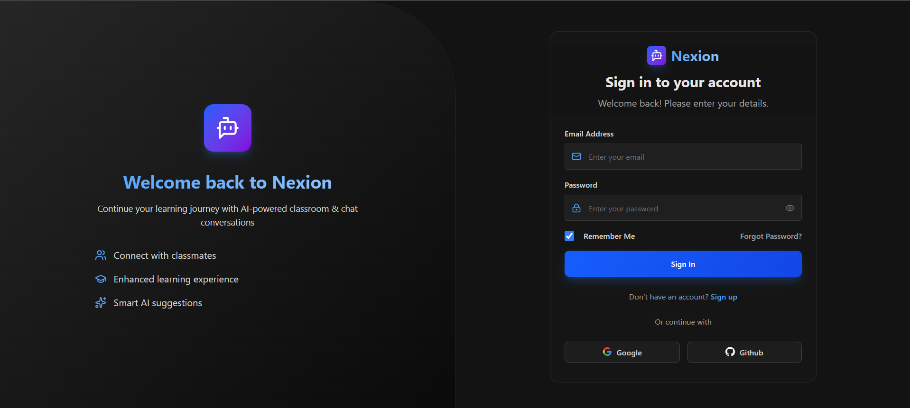
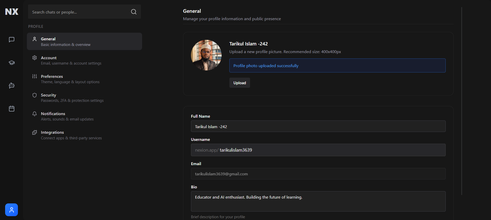
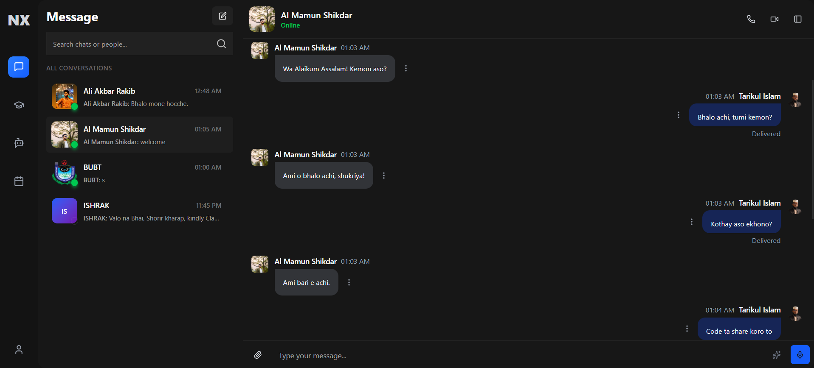
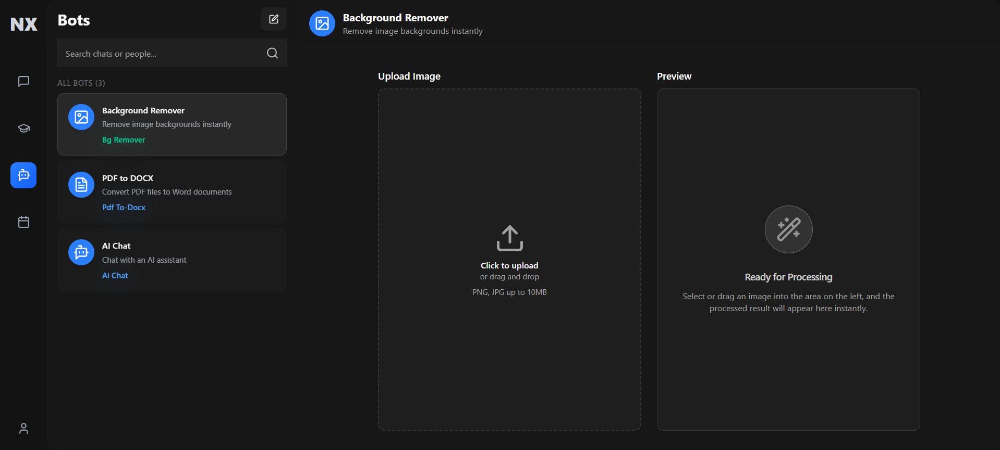
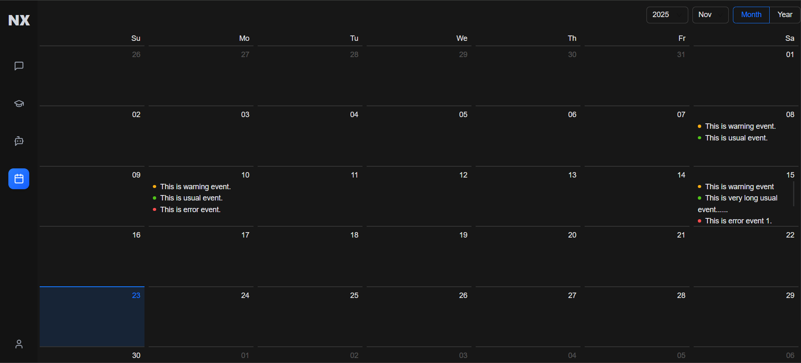

# Nexion


Nexion is an innovative web-based platform that seamlessly integrates a dynamic classroom environment with a robust messaging system. It facilitates effortless communication between students and educators while efficiently managing academic workflows. Key features include AI-driven chatbot assistance to support learning in real time. Designed to enhance collaboration, minimize distractions, and streamline educational processes, Nexion delivers a smart, interactive, and highly organized digital learning experience.

---

## 🌟 Features

- **Authentication & User Profile**
  - Email/password registration and login  
  - Role-based dashboards (Admin/Teacher/Student)  
  - Edit profile (photo, bio, preferences)

- **Messenger**
  - One-to-one & group chat  
  - File sharing (images/docs)  
  - Voice & video call (WebRTC)  
  - Message seen & delivery status  

- **Classroom**
  - Create & join classrooms  
  - Upload & submit assignments  
  - Lecture notes sharing  
  - Teacher-student discussion threads  
  - Attendance tracking  

- **Calendar & Productivity**
  - Event creation, edit, delete  
  - Auto-sync assignments  
  - Reminders & notifications  

- **AI & Bots**
  - Image bot (background remove, resize)  
  - Document bot (PDF ↔ DOC)  
  - AI summarizer & translator  
  - AI chat assistant (suggestions & auto-replies)

---

## 🛠 Tech Stack

| Layer          | Technology |
|----------------|------------|
| Frontend       | Next.js 15, React 19, TailwindCSS 4, Redux Toolkit, Ant Design, Framer Motion |
| Backend        | Node.js (Express), MongoDB, Socket.io, Cloudinary, JWT |
| AI / Bots      | Gemini API, Remove.bg, LibreOffice API |
| Hosting        | Local (Dev) – Cloud deployment planned |
| Version Control| GitHub + Trello for task management |

---

## 📷 Screenshots

These screenshots showcase different UIs and features of the project.  

### Login Page


### Profile


### Chat UI


### Bots UI


<!-- Classroom UI (commented out) -->
<!--  -->

### Calendar


---

> You can add short descriptions under each image to help readers understand the feature shown. For example:
> - **Login Page:** User login form
> - **Profile:** Profile view and edit options
> - **Chat UI:** Messaging interface
> - **Bots UI:** Bot features and controls
> - **Calendar:** Class/event view

---

## 📅 Roadmap

**Phase 1 — Core Setup** ✅  
Backend API, JWT auth, MongoDB connection, frontend layout, role-based access  

**Phase 2 — Messaging System** 🚧  
One-to-one/group chat, file sharing, voice/video call, message status  

**Phase 3 — Classroom System** ⏳  
Class creation/join, assignment upload/submit, lecture notes, discussions, attendance  

**Phase 4 — Calendar & Productivity** ⚙️  
Events, auto-sync assignments, reminders & notifications  

**Phase 5 — AI & Bots** 🤖  
Image/document bot, summarizer, translator, AI chat assistant  

**Phase 6 — Backend & System Integration** 🧠  
API authentication, database, role management, notifications, Cloudinary, analytics  

**Phase 7 — General System Settings** ⚙️  
Theme toggle, language & notification preferences, privacy settings  

---

### 2️⃣ Install Dependencies
#### Frontend:
```bash
cd web
npm install
```
#### Backend:
```bash
cd server
npm install
```
